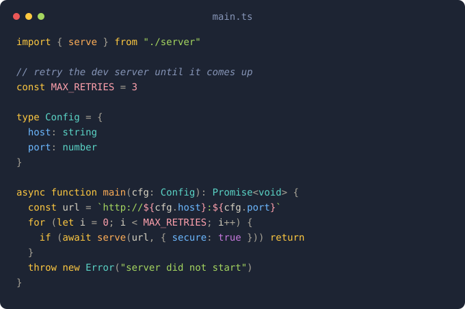

# eggfriedrice

A dark, warm Neovim colorscheme that leans into its name: yolk-yellow literals, rice-cream text, and scallion-green strings on a navy background inspired by [halcyon](https://github.com/bchiang7/halcyon-vscode). Token roles follow [One Dark Pro](https://github.com/Binaryify/OneDark-Pro): red identifiers, purple keywords, green strings. Yellow is the signature and carries functions, types and builtins plus everything One Dark Pro paints orange: numbers, booleans, constants, attributes. Operators are blue where One Dark Pro uses cyan.



## Palette

| Role | Color | Hex |
| ------------------------------------------ | ----------- | --------- |
| Variables, fields, keys, tags, errors | Red | `#e06c75` |
| Keywords, decorators | Purple | `#c084fc` |
| Functions, types, builtins, numbers, booleans, constants | Yolk yellow | `#ffc940` |
| Operators | Blue | `#6cb8ff` |
| Strings | Scallion | `#00c950` |
| Escapes, enum members, accents | Teal | `#78e2d6` |
| Text | Rice cream | `#d8d3c3` |
| Punctuation | Muted | `#a8a396` |
| Comments | Blue gray | `#8695b7` |
| Background | Navy | `#0d111a` |
| Dormant, not assigned to any group | Orange | `#fc9a2c` |

Fields and properties are red on both declaration and access, like One Dark Pro. Diff, search, and diagnostic backgrounds are blended from these at load time, so overriding a palette color carries through everywhere.

## Features

- Consistent token roles across legacy syntax, treesitter, and LSP semantic tokens - tuned against TypeScript, JavaScript, Go, Rust, Java, Python, Lua, CSS, HTML, YAML, JSON, TOML, and Markdown
- Terminal colors (`:terminal` matches the theme)
- Bundled lualine theme
- `on_colors` / `on_highlights` hooks for overriding anything
- Popular plugin support (Telescope, neo-tree, gitsigns, nvim-cmp, and more)

## Installation

### [lazy.nvim](https://github.com/folke/lazy.nvim)

```lua
{
  "eggfriedrice24/eggfriedrice.nvim",
  lazy = false,
  priority = 1000,
  config = function()
    vim.cmd.colorscheme("eggfriedrice")
  end,
}
```

### vim.pack (Neovim 0.12+)

```lua
vim.pack.add({ "https://github.com/eggfriedrice24/eggfriedrice.nvim" })
vim.cmd.colorscheme("eggfriedrice")
```

## Configuration

`setup()` is optional and only needed to change defaults. Call it before `colorscheme`. Full docs: `:h eggfriedrice`.

```lua
-- defaults
require("eggfriedrice").setup({
  transparent = false,    -- no background; let the terminal show through
  italic_comments = true, -- italic comments
  dim_inactive = false,   -- darker background in inactive windows
  on_colors = nil,        -- fun(colors): tweak the palette
  on_highlights = nil,    -- fun(highlights, colors): tweak highlight groups
})

vim.cmd.colorscheme("eggfriedrice")
```

### Transparent background

Removes editor, float, and sidebar backgrounds so your terminal's background (and its opacity or blur) shows through:

```lua
{
  "eggfriedrice24/eggfriedrice.nvim",
  lazy = false,
  priority = 1000,
  config = function()
    require("eggfriedrice").setup({
      transparent = true,
    })
    vim.cmd.colorscheme("eggfriedrice")
  end,
}
```

### Upright comments

```lua
require("eggfriedrice").setup({
  italic_comments = false,
})
```

### Dim inactive windows

Inactive windows get the darker background shade (ignored while `transparent` is set):

```lua
require("eggfriedrice").setup({
  dim_inactive = true,
})
```

### Overriding the palette

`on_colors` runs before highlights are built and receives the complete palette, including semantic aliases (`error`, `git_add`, ...) and derived backgrounds (`diff`, `search`, ...). Changes carry through everywhere:

```lua
require("eggfriedrice").setup({
  on_colors = function(c)
    c.green = "#b0e070"   -- brighter strings
    c.comment = "#8a8578" -- brighter comments
  end,
})
```

### Overriding highlight groups

`on_highlights` runs after all groups are built and can change or add any group. The dormant orange is in the palette for exactly this:

```lua
require("eggfriedrice").setup({
  on_highlights = function(hl, c)
    hl.CursorLineNr = { fg = c.red, bold = true }
    hl["@punctuation.special"] = { fg = c.orange }
    hl.TelescopeBorder = { fg = c.fg_gutter }
  end,
})
```

### lualine

A matching lualine theme is bundled (normal is yellow, insert green, visual purple, replace red, command cyan):

```lua
require("lualine").setup({
  options = { theme = "eggfriedrice" },
})
```

## Supported Plugins

- [telescope.nvim](https://github.com/nvim-telescope/telescope.nvim)
- [nvim-tree.lua](https://github.com/nvim-tree/nvim-tree.lua)
- [neo-tree.nvim](https://github.com/nvim-neo-tree/neo-tree.nvim)
- [gitsigns.nvim](https://github.com/lewis6991/gitsigns.nvim)
- [indent-blankline.nvim](https://github.com/lukas-reineke/indent-blankline.nvim)
- [which-key.nvim](https://github.com/folke/which-key.nvim)
- [nvim-cmp](https://github.com/hrsh7th/nvim-cmp)
- [lazy.nvim](https://github.com/folke/lazy.nvim)
- [mason.nvim](https://github.com/williamboman/mason.nvim)
- [bufferline.nvim](https://github.com/akinsho/bufferline.nvim)
- [nvim-notify](https://github.com/rcarriga/nvim-notify)
- [noice.nvim](https://github.com/folke/noice.nvim)
- [flash.nvim](https://github.com/folke/flash.nvim)
- [mini.nvim](https://github.com/echasnovski/mini.nvim)
- [lualine.nvim](https://github.com/nvim-lualine/lualine.nvim)

## License

MIT
